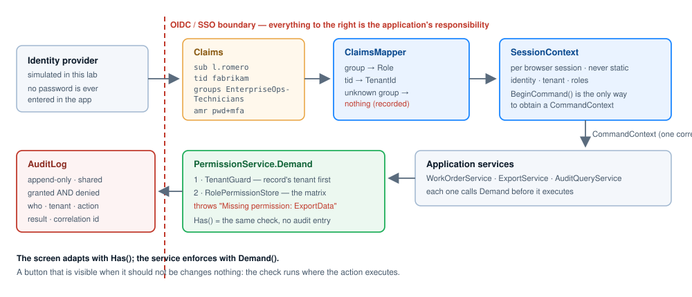

# Identity mapping design — EnterpriseOps

Deliverable 1 of Module 10. How an external identity becomes something this application can authorize against.

## The boundary

An OpenID Connect / SSO login ends with the provider handing the application a **verified identity** expressed
as claims. That is where the provider's job ends and the application's begins. Everything to the right of that
line — roles, tenants, permissions, audit — is ours.

In this sample the provider is simulated (`Security/SsoIdentityProvider.cs`). There is no network call, no token
signature, and **no password field anywhere in the application**: the sign-in gate picks which identity the
provider should assert and shows the claim list that crosses the boundary. Replacing it with real OIDC
middleware changes that one file; nothing downstream moves.

## The three layers

| Layer | Question it answers | Where it lives |
|---|---|---|
| Identity | Who is this? | `MappedIdentity.UserId`, `DisplayName`, `Email` — from `sub`, `name`, `email` |
| Membership | Which tenants and roles do they hold? | `MappedIdentity.TenantId` (from `tid`) + `Roles` (from `groups`), recorded in `RolePermissionStore.SetMembership` |
| Permissions | What may that role do? | The permission matrix in `RolePermissionStore` — see `PermissionMatrix.md` |

The same person can be a dispatcher in one tenant and a read-only auditor in another, because membership is
keyed by **user + tenant**, never by user alone.

## The claims this application reads

| Claim | Meaning | Consumed by |
|---|---|---|
| `sub` | Stable subject id → `CommandContext.UserId` | everything; the audit log's User column |
| `name` | Display name for the header bar | `lblUser` only — never a decision |
| `email` | Contact, shown on the gate | nothing authorizes on it |
| `tid` | Tenant id → `CommandContext.TenantId` | `TenantGuard`, every query, every audit row |
| `groups` | Repeated once per directory group → `Role` | `ClaimsMapper`, then `RolePermissionStore` |
| `amr` | Authentication method (`pwd+mfa`) | recorded in the sign-in audit entry |
| `auth_time` | When the provider authenticated | `MappedIdentity.AuthTimeUtc` |

`Security/ClaimTypes.cs` is the only place these strings appear. A provider that calls the tenant claim
`http://schemas.contoso/tenant` instead of `tid` is a one-line change there.

## Group → role mapping

`ClaimsMapper.GroupToRole` — the one table that couples this application to the corporate directory:

| Directory group | Application role |
|---|---|
| `EnterpriseOps-Technicians` | `Technician` |
| `EnterpriseOps-Managers` | `Manager` |
| `EnterpriseOps-Admins` | `Admin` |
| `EnterpriseOps-Auditors` | `Auditor` |
| `EnterpriseOps-Integration` | `ServiceAccount` |

Three rules the mapper enforces:

1. **An unknown group grants nothing.** It is never rounded up to the nearest role and never falls back to a
   default. `t.novak` in the directory carries `CorpVPN-Users` and signs in with zero permissions.
2. **The tenant comes from the token.** Not from a dropdown, a query string or a hidden field — all three are
   editable in the browser.
3. **What could not be mapped is reported, not swallowed.** `MappedIdentity.UnmappedGroups` reaches the screen,
   so "why can't I do anything?" has an answer on the screen rather than in a support ticket.

In production the table belongs in configuration, so onboarding a new group is a change ticket rather than a
deployment.

## Session context

`SessionContext` is built once, at sign-in, from the mapped identity, and parked in the Wisej.NET session
(`Application.Session`), never in a static field — every browser session of every user runs in the same process.

It holds: user id, display name, tenant, roles, sign-in time, and the command that is running now. Screens read
it cheaply; services never parse a claim again.

`SessionContext.BeginCommand()` is the **only** way to obtain a `CommandContext`, and it throws when nobody is
signed in. That is what makes "the gate sits in front of every entry point" true by construction rather than by
discipline: a background job, a `[WebMethod]` or a second screen that forgets to sign in cannot call a service
at all, because it has nothing to pass.

`SessionContext.RefreshPermissions()` re-fetches and re-maps the claims for the signed-in subject and bumps
`PermissionGeneration`. Roles change while sessions are open; a long-running session must be able to reload them
without forcing a new login.

## Directory used by the lab

| Subject | Tenant | Group | Role | Why it exists in the lab |
|---|---|---|---|---|
| `m.weber` | fabrikam | Managers | Manager | approves work orders, requests exports |
| `l.romero` | fabrikam | Technicians | Technician | the walkthrough's denied export |
| `j.kim` | fabrikam | Auditors | Auditor | reads the trail; releases exports, cannot request one |
| `d.singh` | fabrikam | Admins | Admin | the separation-of-duties refusal |
| `svc.import` | fabrikam | Integration | ServiceAccount | a non-human caller with edit rights only |
| `ana.ops` | **contoso** | Managers | Manager | the cross-tenant path — a real manager, wrong tenant |
| `t.novak` | fabrikam | `CorpVPN-Users` | *(none)* | authenticated, entitled to nothing |

## Evidence in the running app

- Start the app: the gate opens **before** any data is loaded. Select an account and the middle list shows the
  raw claims; the box below shows what `ClaimsMapper` made of them.
- Sign in as `t.novak`: the screen unlocks with an amber banner naming the unmapped group, every command button
  is hidden, and the work queue is empty because `Demand(ViewWorkOrders)` refused — visible in the trace and in
  the audit log.
- Sign in as `ana.ops` and press **Fail: cross-tenant approve**: the tenant on the context came from `tid`, and
  the guard rejects the fabrikam record before any role is consulted.
- **Switch identity (SSO)** signs out; the header, the buttons and the audit scope all change, and the audit log
  keeps every identity's entries.
