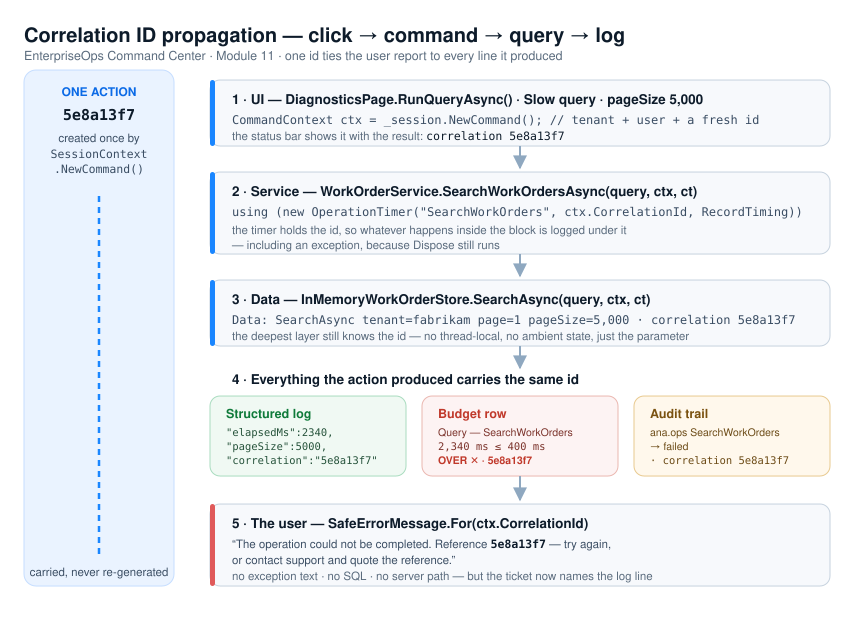

# Deliverable 3 — Correlation ID propagation

**Code:** `Services/SessionContext.cs` (`NewCorrelationId`, `NewCommand`) · `Services/CommandContext.cs` ·
`Services/WorkOrderService.cs` · `Data/InMemoryWorkOrderStore.cs` · `Diagnostics/StructuredLog.cs` ·
`Security/AuditTrail.cs` · `UI/DiagnosticsPage.cs` (`RunQueryAsync`)



## The rule

**One user action = one correlation id, created once and passed as a parameter.**

```csharp
public string NewCorrelationId() => Guid.NewGuid().ToString("N").Substring(0, 8);
public CommandContext NewCommand() => new CommandContext(Tenant.Id, User.UserName, NewCorrelationId());
```

Eight hex characters: short enough for a user to read over the phone or paste into a ticket, unique enough
for a day of one deployment's logs. A full GUID is unreadable aloud; a sequence number collides across
nodes.

`CommandContext` is the carrier — `record CommandContext(string TenantId, string UserName, string CorrelationId)` —
and it is an explicit **parameter** on every service and data method:

```csharp
Task<SearchResult>           SearchWorkOrdersAsync(WorkQueueQuery query, CommandContext ctx, CancellationToken ct)
Task<PagedResult<WorkOrder>> SearchAsync(WorkQueueQuery query, CommandContext ctx, CancellationToken ct)
```

Not a thread-local, not an ambient static, not `Application.Session`. A parameter cannot be lost by an
`await` continuation, cannot be picked up by the wrong session, and is visible to anyone reading the
signature — which is the same reason `SessionContext` itself is never static.

## Where the id is created — and where it is not

| Moment | Correlation id |
|---|---|
| Page load | new (`DiagnosticsPage_Load`) — startup, screen load and binding-refresh measurements share it |
| Each query button | new, in `RunQueryAsync`; the status bar shows it with the result |
| Each live-refresh timer tick | new — a tick is an independent unit of work |
| **Inside** a service call | **never** — services *receive* `ctx`, they do not mint ids |
| The retry after a failure | new — a retry is a new action; the ticket names *both* ids |

## What the id reaches

For one click of **Slow query · 5000**, this is everything stamped `5e8a13f7` in the server trace
(`System.Diagnostics.Trace`):

```
Service: SearchWorkOrders tenant=fabrikam user=ana.ops page=1 pageSize=5,000 · correlation 5e8a13f7
Data:    SearchAsync tenant=fabrikam page=1 pageSize=5,000 · correlation 5e8a13f7
Data:    50 of 50 rows materialized in ≈2,340 ms (pageSize 5,000 forced a full scan) · correlation 5e8a13f7
Diagnostics: OperationTimer SearchWorkOrders 2,340 ms · correlation 5e8a13f7 · budget ≤ 400 ms → OVER ✕
```

plus, beyond the server trace:

- the **structured log** entry, with `"correlation":"5e8a13f7"` as its last field;
- the **budget row** — `BudgetRow.CorrelationId` records *which* action produced the measurement, so the
  red row on the table is evidence with a story, not a bare number;
- on a failure, the **audit entry** (`AuditTrail.Record(user, action, outcome, correlationId)`);
- the **message the user sees** — `SafeErrorMessage.For(correlationId)`.

That last one closes the loop. The user reports *"it failed, reference 5e8a13f7"*; support filters the log
by that id and gets the full trace of that one action, on that one node, for that one tenant, with the
elapsed time and the field that caused it. Nobody guesses.

## Propagating past the request

Two boundaries need care, and both appear here:

- **The timer tick** (`timerLive_Tick`) is not a user request, so it creates its own id rather than reusing
  a stale one. A background job that reuses the id of the request that scheduled it should carry that id as
  a *parent* field and mint its own — never silently share one.
- **The `OperationTimer` callback** runs in `Dispose`, i.e. possibly during exception unwinding. It is
  handed the correlation id by value at construction time, so the log entry is correct even when the block
  is exiting abnormally.

## Evidence — what the running app shows

1. Click a query button: the status bar reads `OperationTimer — SearchWorkOrders … · correlation <8 hex> · …`
   and the new structured log line ends with the same id.
2. In the server trace output, every `Service:`, `Data:` and `Diagnostics:` line for that click repeats the
   *same* id; the next click gets a different one.
3. Click **Slow query · 5000**, then **Fix page size**: two different ids, one over budget and one within,
   proving the fix on the same operation rather than on a claim.
