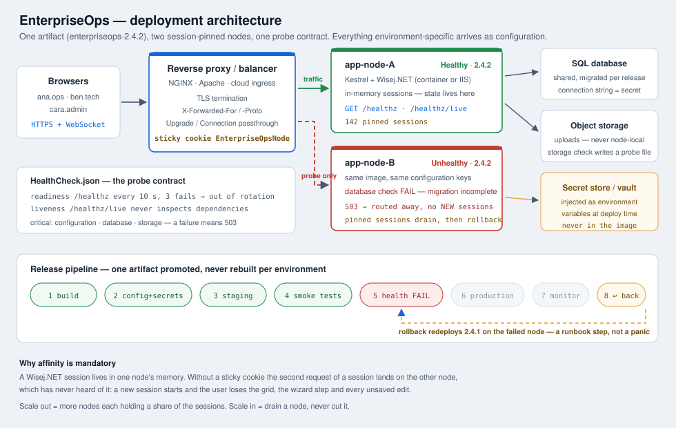

# Deliverable 1 — Deployment architecture diagram

*(the diagram source is `DeploymentArchitecture.svg` in this folder)*

## What the diagram says

| Layer | Element | Responsibility | Where it is in the sample |
|---|---|---|---|
| Client | Browsers | HTTPS + one long-lived WebSocket per session | `Default.html` bootstraps `wisej.wx` |
| Edge | Reverse proxy / balancer | TLS termination, `X-Forwarded-For` / `X-Forwarded-Proto`, `Upgrade`/`Connection` passthrough, **sticky cookie** | `deployment/nginx.conf`, `Startup.cs` `UseForwardedHeaders` |
| Application | `app-node-A`, `app-node-B` | Kestrel + Wisej.NET, **in-memory session state**, `/healthz` + `/healthz/live` | `Startup.cs`, `Services/HealthProbeService.cs`, `Services/LoadBalancerSimulator.cs` |
| Data | SQL database | shared across nodes, migrated once per release | `Data/WorkOrderRepository.cs` (in-memory fake for the lab) |
| Data | Object storage | uploads — never node-local disk, or a drained node loses files | `storage` check in `HealthCheck.json` |
| Secrets | Vault / platform secret store | supplies `EnterpriseOps__ConnectionString`, `EnterpriseOps__IdentityProvider__ClientSecret` as environment variables at deploy time | `Services/ConfigurationService.PlatformSecrets`, `Services/StartupValidation.cs` |
| Pipeline | build → config → staging → smoke → health → production → monitor → rollback | one artifact promoted, never rebuilt per environment | `Services/ReleaseService.cs`, `ReleaseRunbook.md` |

## Deployment targets this architecture supports unchanged

| Target | What changes | What stays the same |
|---|---|---|
| **IIS on Windows** | app pool identity, recycling rules, `Web.config`, WebSocket feature must be installed | the same build, the same `appsettings.{Environment}.json`, the same `/healthz` |
| **Kestrel behind NGINX/Apache** | the proxy owns TLS and must forward `Upgrade`; the app must trust forwarded headers | `deployment/nginx.conf` is the only new artifact |
| **Azure App Service / AWS** | platform supplies TLS, scaling rules, log sinks and the secret store; ARR affinity (Azure) or a target-group stickiness rule (AWS ALB) supplies the pin | `HealthCheck.json` becomes the platform's health probe path |
| **Docker / compose / an orchestrator** | the image is the unit of deployment; the host still needs affinity, WebSocket and probe settings | `deployment/Dockerfile`, `deployment/docker-compose.yml` — *written for reading, never built in this lab* |

## The three things to verify before committing to a target

1. **WebSockets pass through every layer** between browser and application — proxy, balancer, WAF, ingress. Idle timeouts must exceed the session timeout.
2. **The health check endpoint is reachable by the infrastructure** — not just from a developer's laptop, and answering the status code the balancer expects (200 / 503).
3. **The application sees the real client address and scheme** through the proxy headers, or every audit line and every redirect is wrong.

## Evidence in the running sample

- Start the app and look at the **Nodes — live from HealthCheck.json** grid: `app-node-A` is this process (its row comes from the real `GET /healthz`), `app-node-B` is the simulated peer.
- `GET http://localhost:5212/healthz` returns the readiness body; `GET /healthz/live` returns liveness. The `.json` files themselves are never served — `Startup.cs` filters them out of the file server.
- **Fail: balancer without affinity** routes this session's next request round-robin, and the trace shows `app-node-B has no session … in memory → a NEW session starts`. That is the diagram's "why affinity is mandatory" note, executed.
