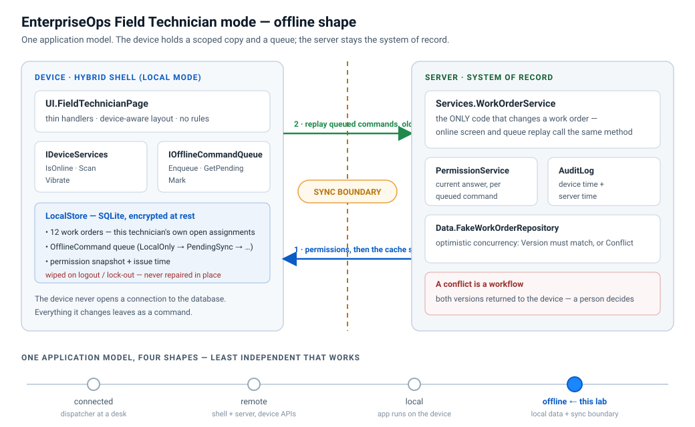

# Hybrid / offline architecture note — Field Technician mode

**Deliverable 1 of Module 13.** Decided before any screen was drawn, because the answer decides where
identity, data and permissions live.



## 1. The decision

| | |
|---|---|
| **Shape chosen** | **Offline** = local mode + local data + an explicit synchronization boundary |
| **Scope** | The *Field Technician* workflow only. Everything else in EnterpriseOps stays **connected**. |
| **Who is offline** | A technician on site — basements, plant rooms, valve yards — with no reliable signal. |
| **Who is not** | Dispatchers, managers, admins, reporting. They sit at a desk; connected mode is simpler and has one copy of the data. |
| **Status** | Accepted for the prototype. Revisit when a second offline workflow is proposed. |

The four shapes trade simplicity for independence in one direction:

```
connected  →  remote  →  local  →  offline
  one copy of the data                       a copy on every device
  one place to enforce rules                 the rules must hold on each of them
```

**Rule of thumb applied here: pick the least independent shape that satisfies the workflow.** Field
completion genuinely cannot wait for a signal, so it goes to *offline*. Nothing else does.

## 2. What data is allowed offline

Exactly one scope, and it is enforced on the **server**, not by the device asking nicely:

* `WorkOrderService.GetAssignedAsync` → `FakeWorkOrderRepository.FindAssigned(tenantId, user)` returns
  **this technician's own, still-open work orders, for one tenant**. Twelve rows in the sample.
* The device caches a projection (`Hybrid.CachedWorkOrder`), never the domain entity: no customer record,
  no pricing, no other technician's work, no closed history.
* Plus two device-local things: the **command queue** and the **permission snapshot**.

Every additional cached entity is more data on a device that can be lost, more sync cases to test and
more conflicts to resolve. The scope is the smallest set the workflow needs.

## 3. State ownership

| State | Owner | Notes |
|---|---|---|
| Work order record | **Server** | `Version` is the concurrency token; only `WorkOrderService` writes. |
| Cached copy of a work order | Device (a *projection*) | Read-only. Replaced by a download, never merged. |
| Offline completion | Device, until it syncs | It is a **proposal**, not a fact. The record is not changed locally. |
| Permission set | **Server** | The device holds a *snapshot* with an issue time. |
| Audit trail | **Server** | Carries device time and server time for every offline command. |

The one-sentence version: **offline work is a proposal that syncs through an explicit, auditable state
machine.** The record only changes on the server.

## 4. The synchronization boundary

`Hybrid/SyncWorkflow.cs`. On reconnect, in this order:

1. **Refresh permissions first.** `PermissionService.Issue(user)` replaces the device snapshot before a
   single command replays. A technician whose grant was removed while they were disconnected must have
   their queued commands **rejected and audited**, not applied.
2. **Replay each command through `WorkOrderService`** — the same method the online screen calls. The
   permission check, the optimistic-concurrency check and the audit entry are therefore literally the same
   code for offline work as for online work. The device never touches `Data/`.
3. **Record the outcome** on the command: `Synced`, `Conflict` or `Rejected`.
4. **Stop at a conflict.** Commands behind it stay `PendingSync` so ordering is preserved.

## 5. Security consequences of going offline

| Risk | What this design does |
|---|---|
| Stale permissions | Re-evaluated on the server per queued command; snapshot replaced on every reconnect. |
| Stolen device | Local store is encrypted at rest and **wiped** on logout / lock-out; cached credentials expire, so a stolen device cannot replay commands after that. |
| Untrusted device input | A scanned barcode is validated server-side (`ValidateScannedAssetAsync`); a GPS reading would be a hint for the user, never proof. |
| Backdated work | Both timestamps are audited: the device clock (`DeviceTimestamp`) *and* the server clock (`ServerTimestamp`). The device clock is evidence of intent, not of time. |
| A screen "just writing" the record | Structurally impossible from the device: the only server entry point is `WorkOrderService`. The **Anti-pattern** button shows what is lost when that rule is broken. |

## 6. PWA shell

The manifest and service worker in [`pwa/`](pwa/) are the deliverable form of the PWA shell decision.
They are **not wired into the running sample** — `Default.html` registers nothing — because a service
worker caching a Wisej.NET session shell is a deployment decision that belongs with Module 12's release
runbook, not with a lab. See [`PwaShellNote.md`](PwaShellNote.md).

## Evidence — what the running app shows

| Claim | Where you see it |
|---|---|
| Cache scope is server-enforced and small | Trace: `Data: repository.FindAssigned(contoso, ben.tech) → 12 rows (of 48 in the store)` and `Device: cache scope: ben.tech's own open assignments…` |
| The record is not changed offline | Complete a work order while offline: the **Server status** column still reads `Assigned`; only **On this device** says `Completed · pending sync`. |
| Permissions are refreshed before replay | Trace on reconnect: `Job: reconnect 1/2 — permission snapshot refreshed BEFORE replay: …` |
| Offline work replays through the same service | Trace: `Job: replay 1/3: WO-1041 → WorkOrderService.Complete (corr …) — the same service the online screen calls` |
| Both timestamps are audited | `Security/AuditLog.AuditEntry.ToString()` renders `device 14:32 · server 15:07`. |
| Bypassing the boundary loses information | **Anti-pattern** button: four red trace lines, and `audit log still has N entries` — unchanged. |
