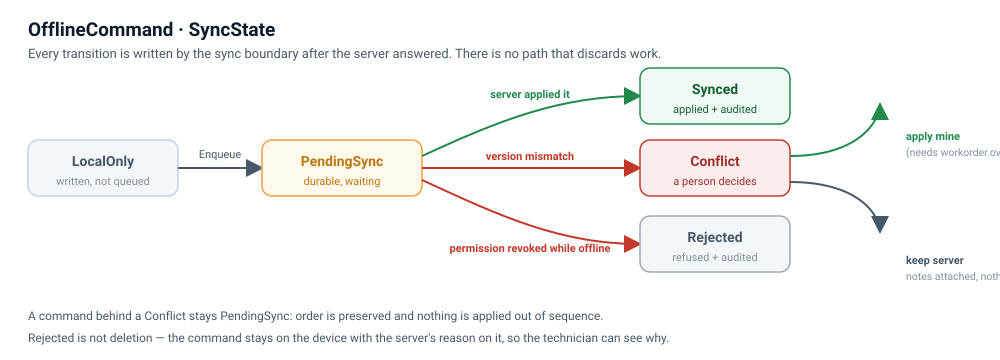

# Offline queue model

**Deliverable 3 of Module 13.** Every offline action is a durable command with an explicit state.



## The model

`Hybrid/HybridOfflinePatterns.cs`:

```csharp
public enum SyncState { LocalOnly, PendingSync, Synced, Conflict, Rejected }

public sealed record OfflineCommand(
    Guid LocalId,
    string CommandName,
    string EntityId,
    string PayloadJson,
    DateTimeOffset CreatedAt,
    SyncState State);

public interface IOfflineCommandQueue
{
    Task EnqueueAsync(OfflineCommand command);
    Task<IReadOnlyList<OfflineCommand>> GetPendingAsync();
    Task MarkAsync(Guid localId, SyncState state, string? message = null);
}
```

Why each field is there:

| Field | Why |
|---|---|
| `LocalId` | Generated on the device. The identity of the *intention*, independent of any server id, so a retry cannot double-apply. |
| `CommandName` | `"CompleteWorkOrder"`. The queue is generic; adding a second offline action does not change the queue. |
| `EntityId` | `"WO-1041"` — enough to render a card without deserializing the payload. |
| `PayloadJson` | The typed command, serialized **at the moment the technician acted**. Replay is deterministic even if the screen changed since. |
| `CreatedAt` | The **device clock**. Audited separately from the sync time; it is evidence of intent, not of time. |
| `State` | The whole point: there is no "probably saved". |

Lab additions carried alongside (`Summary`, `SyncMessage`, `BaseVersion`, `SyncedAt`, `CorrelationId`)
let the screen render a card and link a command to its audit entry. `BaseVersion` is the version the
device held — the optimistic-concurrency input.

## The states

| State | Meaning | Set by |
|---|---|---|
| `LocalOnly` | Written on the device, not yet queued. | the screen (not used by the completion flow, which queues immediately) |
| `PendingSync` | Durable, waiting for a connection. | `EnqueueAsync` |
| `Synced` | The server applied it and audited it. | sync boundary, after `CommandResult.Succeeded` |
| `Conflict` | The row changed on the server while the device was away. A person decides. | sync boundary, after `CommandResult.IsConflict` |
| `Rejected` | The server refused it (permission revoked), or the technician chose the server's version. | sync boundary |

**`Rejected` is not deletion.** The command stays on the device with the server's reason attached, so the
technician can see why their work did not land instead of wondering.

## Rules the queue obeys

1. **Append only, replay in order.** `GetPendingAsync` orders by `CreatedAt`. Two completions of the same
   work order replay in the order the technician made them; the second becoming a conflict is
   information, never noise to be coalesced away.
2. **The queue decides nothing.** It appends, reads and records. Every outcome comes from
   `WorkOrderService`.
3. **A conflict stops the replay.** Commands behind it stay `PendingSync`. Ordering is preserved and
   nothing is applied out of sequence while a person is thinking.
4. **Durable, not clever.** On a device the store is the SQLite file, so a queued command survives the
   application being killed mid-shift. In this sample `Hybrid/LocalStore.cs` is the in-memory stand-in
   with the same surface.
5. **Retry is safe.** A command is only marked `Synced` after the server said so; a failed sync leaves
   the queue untouched, and **Sync now** replays it.
6. **The queue is wiped with the device.** Logout, lock-out or the recovery path destroys it — pending
   work included. That is a deliberate product decision: a device whose state is doubted is re-provisioned,
   never repaired.

## Where it lives in the code

| Piece | File |
|---|---|
| Contract + record + states | `Hybrid/HybridOfflinePatterns.cs` |
| Device-side implementation | `Hybrid/OfflineCommandQueue.cs` (`LocalOfflineCommandQueue`) |
| Durable store (SQLite stand-in) | `Hybrid/LocalStore.cs` |
| Replay + state transitions | `Hybrid/SyncWorkflow.cs` |
| Cards on screen | `UI/OfflineCommandRow.cs` inside `flpQueue` |

## Evidence — what the running app shows

| Claim | Where you see it |
|---|---|
| Enqueue is explicit and sized | Trace: `Device: queue.Enqueue CompleteWorkOrder WO-1041 (base v2) → PendingSync · 1 pending · payload 138 bytes` |
| The record is untouched until sync | The grid's **Server status** stays `Assigned` while the card says `PendingSync` |
| Replay is ordered and paced | Three queued completions turn `Synced` one at a time, 700 ms apart, with the progress bar advancing |
| The state machine is visible | Queue cards colour by state: amber `PendingSync`, green `Synced`, red `Conflict`, grey `Rejected` |
| A conflict preserves order | After the conflict card appears, the queue title still shows the commands behind it as `PendingSync` |
| Rejection keeps the evidence | Press **Revoke ben.tech's permission** before syncing: cards go `Rejected` with `permission workorder.complete revoked` on them, and the audit log has a `Rejected` entry |
