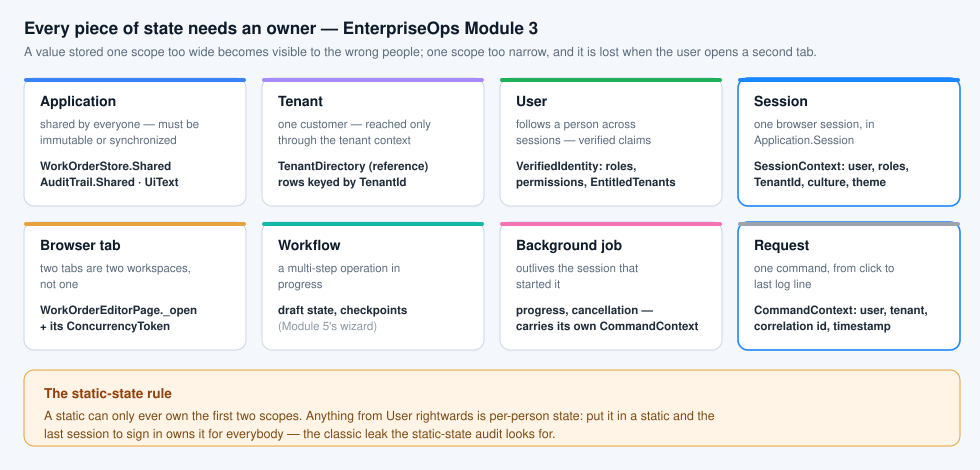

# Deliverable 1 — Tenant-aware SessionContext

*EnterpriseOps · Advanced Module 3 · `Security/SessionContext.cs`, `Security/VerifiedIdentity.cs`,
`Security/IdentityProvider.cs`, `Services/TenantDirectory.cs`*

## What it is

One object, created once per browser session from **verified claims**, stored in `Application.Session`. It owns:

| Property | Scope | Where it comes from |
|---|---|---|
| `SessionId` | session | `Application.SessionId` |
| `UserId`, `DisplayName` | user | the identity provider |
| `Roles`, `Permissions` | user | the identity provider |
| `EntitledTenants` | user | the identity provider — the tenants this person may work in |
| `Culture`, `Theme` | session | claims + user preference |
| `TenantId` | session | the tenant the user is working in *right now* |
| `SignedInAt`, `CorrelationId` | session | the sign-in itself |

`TenantId` has a **private setter**. The only way it changes is `SwitchTenant(id)`, and that method checks
`EntitledTenants` before it moves anything:

```csharp
public TenantSwitchResult SwitchTenant(string tenantId)
{
    if (string.Equals(tenantId, TenantId, StringComparison.Ordinal))
        return TenantSwitchResult.Unchanged(TenantId);

    if (!IsEntitledTo(tenantId))
        return TenantSwitchResult.Rejected(TenantId, tenantId, …);

    string previous = TenantId;
    TenantId = tenantId;
    return TenantSwitchResult.Switched(previous, tenantId);
}
```

## Why the dropdown cannot spoof the tenant

`cboTenant` is filled from `TenantDirectory.EntitledFor(session)` — the deployment's tenants filtered by the
session's claims. Filling the list from the claims is a **convenience**, not the control: anything that arrives
from the browser is passed straight back through `SwitchTenant`, which re-checks the entitlement. A value the
list never offered is rejected, and the session keeps the tenant it had.

Everything downstream then reads the tenant from the session, never from a control:

```
cboTenant  →  SessionContext.SwitchTenant  →  SessionContext.TenantId
                                                 ↓
                                          BeginCommand(name)  →  CommandContext.TenantId
                                                                    ↓
                                          WorkOrderService  →  TenantGuard.DemandTenant(context, row.TenantId)
```

There is no call shape anywhere in `Services/` that takes a tenant id from a caller and trusts it.
`SaveWorkOrderCommand` does carry a `TenantId`, and the service treats it as a claim to be **checked**, not
obeyed: `_guard.DemandTenant(context, command.TenantId)` runs before anything else, then the row's own tenant is
checked the same way.

## Why it is never static

The server process hosts every session in the same memory. A `static SessionContext Current` would be one object
for the whole machine: the last user to sign in would own it, and the next request from anybody else would run as
that person. See [`StaticStateAuditReport.md`](StaticStateAuditReport.md).

The context therefore lives in `Application.Session`, the per-user bag Wisej keeps alive for one browser session:

```csharp
Application.Session.Context = _session;   // UI/WorkOrderEditorPage.StoreSessionContext()
```

## What the session context does *not* own

The open work order and its version token. That is **tab state**: it belongs to the window that opened the
record, and it lives in a field of `WorkOrderEditorPage` (`_open`). Two tabs are two editors with two tokens; a
"current work order" on the session context would make the second tab overwrite the first one's token.



## Evidence — what the running app shows

| Action | What you see |
|---|---|
| First load | `cboTenant` offers only Contoso and Fabrikam (the tenants `ana.ops` is entitled to); the queue shows contoso rows |
| `cboTenant` → Fabrikam Utilities | the editor is dropped, the queue reloads with only fabrikam rows |
| A tampered request carrying a tenant the list never offered | `SwitchTenant` returns `Rejected`; amber banner; the dropdown snaps back; the queue is unchanged |
| A command touching another tenant's record | `TenantGuard` throws `CrossTenantAccessException` before the record is read; red banner with the correlation id |
