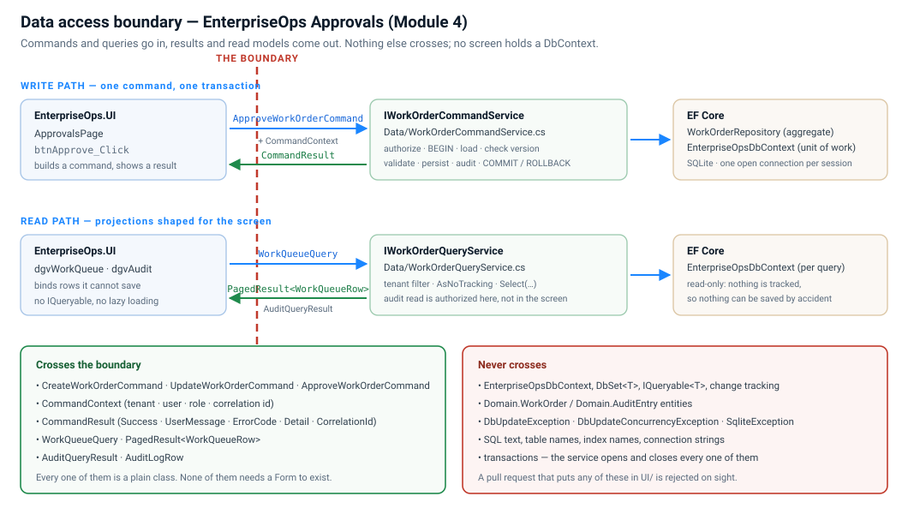

# Deliverable 1 — Data access boundary diagram



*(`data-access-boundary.svg`, in this folder.)*

## The line, in one sentence

`EnterpriseOps.UI` may build **commands** and **queries** and may render **results** and **read models**.
Everything else about persistence — the `DbContext`, the entities, the transactions, the SQL and the
provider's exceptions — lives behind `EnterpriseOps.Services` interfaces and is implemented in
`EnterpriseOps.Data`.

## What crosses, by name

| Direction | Type | Defined in |
|---|---|---|
| UI → service | `CreateWorkOrderCommand`, `UpdateWorkOrderCommand`, `ApproveWorkOrderCommand` | `Services/Commands/` |
| UI → service | `CommandContext` — tenant · user · role · correlation id | `Services/Commands/CommandContext.cs` |
| UI → service | `WorkQueueQuery` | `Services/Queries/WorkQueueQuery.cs` |
| service → UI | `CommandResult` — `Success · UserMessage · ErrorCode · Detail · CorrelationId · NewVersion` | `Services/Commands/CommandResult.cs` |
| service → UI | `PagedResult<WorkQueueRow>` | `Services/Queries/` |
| service → UI | `AuditQueryResult` (`Allowed` · `DeniedReason` · `Rows`), `AuditLogRow` | `Services/Queries/` |

## What never crosses

`EnterpriseOpsDbContext` · `DbSet<T>` · `IQueryable<T>` · `Domain.WorkOrder` · `Domain.AuditEntry` ·
`IDbContextTransaction` · `DbUpdateException` · `DbUpdateConcurrencyException` · `SqliteException` ·
SQL text · table, column and index names · the connection string.

Grep proves it — every one of these appears only under `Data/`:

```
Data/EnterpriseOpsDbContext.cs      the unit of work + the model (indexes, concurrency token)
Data/SessionDatabase.cs             the session-long SQLite connection, the short-lived context factory
Data/WorkOrderRepository.cs         load/save the aggregate by tenant + id
Data/WorkOrderCommandService.cs     authorize → transaction → validate → persist → audit → commit
Data/WorkOrderQueryService.cs       AsNoTracking projections for screens
Data/ErrorMap.cs                    provider exception → result code + user message + audit line
```

`UI/ApprovalsPage.cs` has no `using Microsoft.EntityFrameworkCore` and no `using EnterpriseOps.Data`
type other than the three constructors it wires in one place (`SessionDatabase`,
`WorkOrderCommandService`, `WorkOrderQueryService`) — the composition root. After that it talks to
`IWorkOrderCommandService` and `IWorkOrderQueryService` only.

## Why this shape and not a smaller (or larger) one

The lesson's rule is *add a layer when it isolates something that changes, simplifies a test, or stops
queries spreading through the code*. This sample has exactly four pieces on the data side, and each one
earns its place:

| Piece | The concrete problem it solves |
|---|---|
| **Command service** (write) | The transaction boundary needs one owner that can see the whole operation. Handlers and repositories cannot. |
| **Query service** (read) | Screens want flat, denormalised rows; commands want aggregates. Forcing both through one repository makes both worse. |
| **Repository** | Commands always load *by tenant + id*, so a command can never touch another tenant's row by mistake. One method, one rule, enforced everywhere. |
| **DbContext** | EF Core's own unit of work. Wrapping it in a second "unit of work" abstraction would buy nothing here. |

There is no generic `IRepository<T>`, no specification pattern and no mediator. They would isolate
nothing this application actually changes.

## Evidence in the running app

* **Search** → the server log shows `Data: SELECT … WHERE TenantId='fabrikam' … → 20 of 20
  rows (AsNoTracking, projected to WorkQueueRow)`. The grid is bound to `WorkQueueRow`, not to
  `WorkOrder`: try to save a row and there is nothing to save it with.
* **Approve** → the server log shows the layers in order: `Security: authorize
  ana.ops (Manager) → Approve allowed`, `Data: DbContext #n created`, `Data: BEGIN TRANSACTION`,
  `Data: SELECT WorkOrders WHERE TenantId=… AND Id=… (tracked)`, `Service: validate transition …`,
  `Data: SaveChanges …`, `Data: COMMIT`, `Audit: Approve Committed`, `Service: CommandResult.Ok`.
  Each line names its layer, so the boundary is visible at run time and not only in this document.
* **Any failure path** → the banner shows a `CommandResult.UserMessage`. It never shows an exception
  type, a stack trace, a table name or a SQL statement.
