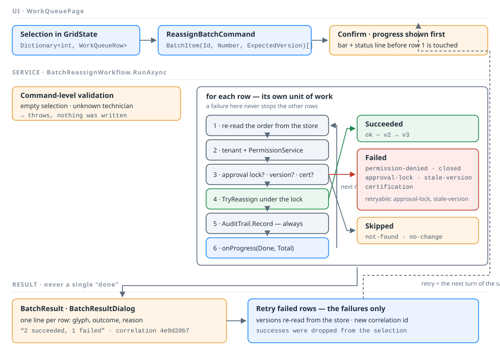

# Deliverable 4 · Batch reassignment workflow

`Services/WorkQueues/ReassignBatchCommand.cs` (command, results, failure codes),
`Services/WorkQueues/BatchReassignWorkflow.cs` (the workflow), `UI/BatchResultDialog.cs` (the report).
Diagram: `BatchReassignmentWorkflow.svg`.



## One user action, N business operations

```csharp
public sealed class ReassignBatchCommand
{
    public IReadOnlyList<BatchItem> Items { get; }      // (WorkOrderId, Number, ExpectedVersion) per row
    public string TargetTechnician { get; }
    public CommandContext Context { get; }              // tenant + user + role + correlation id
    public bool IsRetry { get; }
}
```

The command carries **keys and versions**, never the projected rows the browser was holding. Everything the
workflow decides with, it re-reads from the store.

## Two levels of validation

**Command level** — rejects the whole batch before any row is touched, by throwing `ArgumentException`:

* an empty selection;
* a target that is not a technician.

Nothing was written, so there is nothing to report per row. The screen shows an amber banner and says so.

**Row level** — every row is its own unit of work. `ProcessRow` runs the same checks in the same order and returns
a `BatchRowResult` whatever happens:

| # | Check | Outcome | Code |
|---|---|---|---|
| 1 | exists in **this tenant** | Skipped | `not-found` |
| 2 | `PermissionService.CanReassign(role, order)` — closed order | Failed | `closed` |
| 3 | `PermissionService.CanReassign(role, order)` — role | Failed | `permission-denied` |
| 4 | no open approval on the order | Failed | `approval-lock` |
| 5 | `order.Version == item.ExpectedVersion` | Failed | `stale-version` |
| 6 | target holds `order.RequiredCertification` | Failed | `certification` |
| 7 | target is not already the assignee | Skipped | `no-change` |
| 8 | `WorkOrderStore.TryReassign` re-checks the version **under the lock** and commits | Succeeded | `ok` |

Step 8 is the row's transaction: one order, one lock, one commit, version bumped. Step 5 and step 8 both check the
version because the row can change between the read and the write — that is the double-check a real
`UPDATE … WHERE Version = @expected` gives you for free.

Every row — success, failure or skip — writes exactly **one** audit entry through `Security/AuditTrail.cs`, tagged
with the batch's correlation id. `10 rows → 10 audit entries`, always.

## Partial failure is the expected outcome

```csharp
public sealed class BatchResult
{
    public string CorrelationId { get; }
    public IReadOnlyList<BatchRowResult> Rows { get; }   // every row, in order
    public int Succeeded { get; }  public int Failed { get; }  public int Skipped { get; }
    public bool IsPartialFailure { get; }
    public IReadOnlyList<BatchRowResult> FailedRows { get; }
    public bool HasRetryableFailures { get; }
    public string Summary { get; }                        // "2 succeeded, 1 failed"
}
```

A row that fails **never stops the other rows**. The workflow returns a report; it does not throw. The only
exceptions that leave `RunAsync` are the command-level `ArgumentException` and the `OperationCanceledException`
raised when the user cancels.

## Progress

`RunAsync(command, onProgress, cancellationToken)` calls `onProgress` after **every** row with
`BatchProgress(Done, Total, CurrentNumber, LastOutcome)`. `WorkQueuePage.OnBatchProgress` moves the progress bar
and the status line, then pushes them with `Application.Update(this)` — the pattern for changing controls after an
`await`. The bar and the line appear **before the first row is processed**, so there is feedback inside the first
frame rather than a frozen screen. `RowDelay` (450 ms) makes the progress visible in a lab; a real batch is as
slow as its writes.

The batch button becomes **■ Cancel batch** while the run is in flight. Cancelling is honest about what already
happened: the rows already committed stay committed and stay in the audit log, and the banner says so. A batch is
not a transaction across rows, and pretending otherwise would be a lie the report cannot undo.

## The report and the retry

`UI/BatchResultDialog.cs` lists **every row** with its glyph, outcome and reason — never a single "done". It
enables *Retry failed rows* when `Failed > 0` and closes with `DialogResult.Retry`.

`WorkQueuePage.BuildRetryItems` then re-reads the **current** version of the failed rows from the store and runs
the workflow again with a new correlation id. Two properties follow from that:

* the successes are not repeated — they were removed from the selection when they succeeded;
* the retry sees today's data, so a row that failed with `stale-version` succeeds this time, and a row still locked
  by an approval fails again with the same reason.

`RunBatchLoopAsync` is a `while` loop, not recursion: a retry is the next turn of the same loop.

## The failure path the video shows

Select three rows, press **Fail: approval lock on a row** (opens `APR-1042` on the last one), then
**Reassign 3 selected…**. Two rows are reassigned, one comes back
`locked by an open approval (APR-1042) — not changed`, and the dialog says *Batch result — 2 succeeded, 1 failed*
with a **Retry failed rows** button. Press **Recover: complete the approval**, then retry: the third row goes
through.

Note that ~61 of the seeded contoso rows already carry an open approval (the escalated ones), so selecting a whole
page and reassigning it produces a realistic mixed report without pressing any failure button at all.

## Evidence in the running app

| Do this | The trace shows |
|---|---|
| Run a batch of 3 | `Job: batch 4e9d20b7 — reassign 3 to s.patel by ana.ops (Manager) @ contoso` |
| — per row | `Job: ✓ WO-100234 → reassigned to s.patel (v2 → v3) [ok]` and `Data: commit WO-100234 AssignedTo=s.patel Version 2 → 3` |
| — a failed row | `Job: ✕ WO-100236 → locked by an open approval (APR-1042) — not changed [approval-lock]` |
| — the end | `Job: done 4e9d20b7 — 2 succeeded, 1 failed in 1,4xx ms; 3 audit entries written` |
| **Fail: concurrent edit** then run | `Job: ✕ … → changed by another user (v2 → v3) — refresh and retry [stale-version]` |
| **Run as ben.tech** then run | `Security: ben.tech (Technician) may not reassign WO-…` for every row, `0 succeeded, N failed` |
| Reassign a row needing a certification the target lacks | `[certification]` — e.g. `j.kim` holds only `hvac` |
