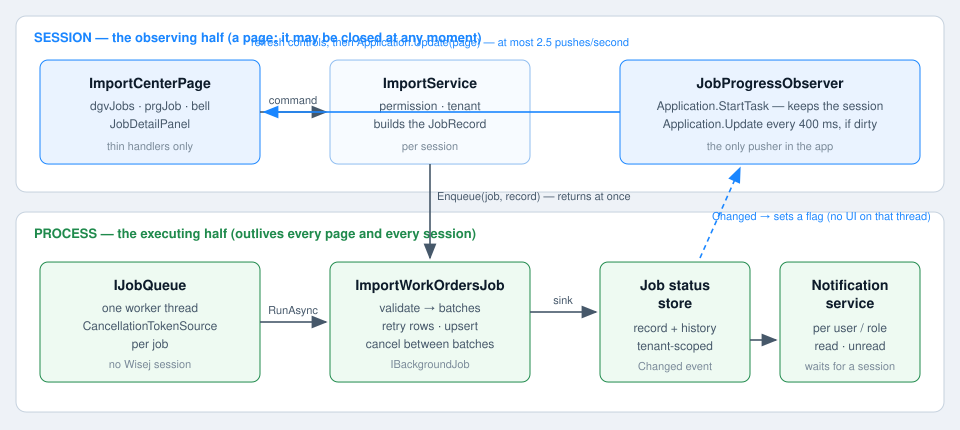

# Deliverable 2 — Background queue abstraction

Starting a job **enqueues** it; a worker picks it up. That one sentence is what makes the executing thread
independent of the request that asked for it — and of the session, which may be gone a second later.



## The abstraction

`Services/Jobs/JobQueue.cs`

```csharp
public interface IJobQueue
{
    JobRecord Enqueue(IBackgroundJob job, JobRecord record);
    bool TryCancel(Guid jobId, string requestedBy);
    int PendingCount { get; }
    bool IsWorkerBusy { get; }
}
```

`IBackgroundJob` (from the lesson resource) is the only thing the queue knows about a job:

```csharp
public interface IBackgroundJob
{
    Guid JobId { get; }
    Task RunAsync(IJobProgressSink progress, CancellationToken cancellationToken);
}
```

No screen type, no session, no `Application`. `ImportWorkOrdersJob` could run in a console worker tomorrow
and nothing in it would change.

## What the in-memory implementation does

`InMemoryJobQueue` — one worker, one job at a time, so a second import genuinely sits at `Queued` while the
first runs (as in the video).

1. `Enqueue` writes the record to the store (`Status = Queued`), keeps a `CancellationTokenSource` **per job**,
   pushes onto a `BlockingCollection` and starts the single worker loop if it is not running. It returns in
   microseconds: the calling request thread is free.
2. `WorkerLoopAsync` consumes the collection on a plain `Task.Run` thread. **That thread has no Wisej
   session.** It cannot touch a control, and never tries: it only writes to the job store and the
   notification service.
3. `RunOneAsync` hands the job a `NotifyingSink` and the token, then catches everything: an
   `OperationCanceledException` becomes `Canceled`, any other exception becomes `Failed` with the type and
   message recorded. A job never takes the worker down.
4. `TryCancel` sets the flag and records `Queue: Cancel requested by … — flag set; the job will stop after
   the current batch.` It stops nothing by itself.

## The sink: how milestones leave the job

`IJobProgressSink.PublishAsync(JobProgress, CancellationToken)` is the job's only output. Two
implementations, composed:

- `JobStatusStoreSink` — writes the milestone into the store. Nothing else.
- `NotifyingSink` (inside the queue) — store first, then decides whether this milestone is *news*:
  `validated` and every final state produce a notification; per-batch progress does not.

The job has no idea whether anyone is watching. That is the point.

## Where the durable things live

`Services/Jobs/JobInfrastructure.cs` holds the queue, the store, the notification service, the fake file
source, the work-order repository and the retry policy in a lazy static bundle. They are the **only** statics
in the sample and they are static on purpose: they stand in for the durable queue and the job/notification
tables that outlive every session. They hold no user or tenant state — every read is tenant-scoped through
the `CommandContext`, so Module 3's static-state audit still passes.

## Evidence in the running app

- Click **+ New import…** twice quickly: the first job goes `Queued → Running`, the second stays `Queued`
  until the worker frees up.
- The job detail's `Queue: Worker picked up IMP-… (thread NN).` history line names the worker thread doing
  the work — not a request thread of any session.
- Close the browser tab mid-import and open the app again: the old page and session are gone while the same
  worker thread keeps going. The percentage does not restart.
