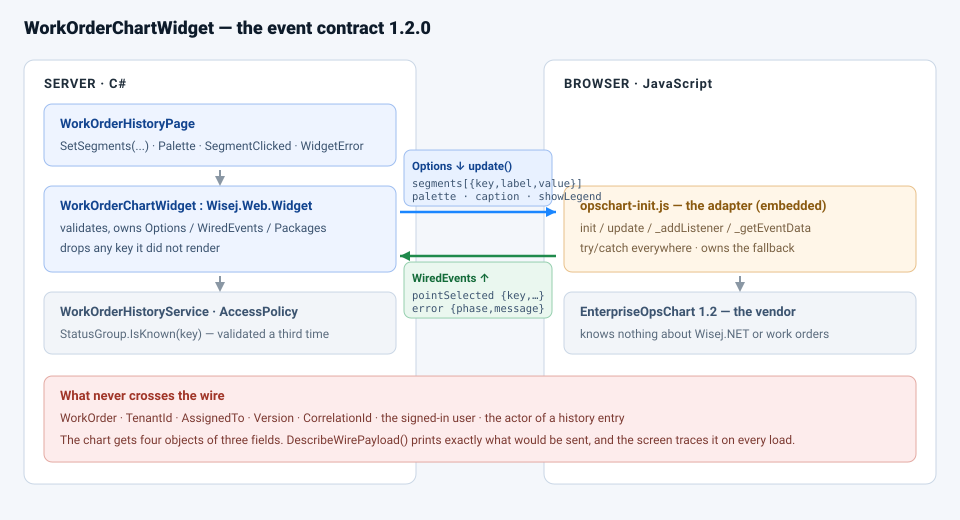

# Deliverable 4 — the client/server event contract

**Component:** `EnterpriseOps.Widgets.WorkOrderChartWidget`
**Adapter:** `Widgets/opschart-init.js` (embedded, versioned with the class)
**Vendor:** `EnterpriseOpsChart 1.2` (`Widgets/vendor-opschart.js`)
**Contract version:** 1.2.0 — changing anything in the tables below is a **breaking change** to the
component and needs a version bump and a release note.

---

## 1. Server → client (state, through `Options`)

The framework serialises `Options` and calls `init(options)` once, then `update(options, old)` on every
**first-level** change. Names are camel-cased on the way down.

| Option | Type | Written by | Meaning |
|---|---|---|---|
| `segments` | `[{ key, label, value }]` | `SetSegments(...)` | The whole breakdown. Replacing the array is a first-level change, so one assignment = one `update()`. |
| `palette` | `string` | `Palette` | `ops` \| `mono` \| `highcontrast`. Validated **server-side**; an unknown palette never leaves the server. |
| `caption` | `string` | `Caption` | Upper-cased by the setter. |
| `showLegend` | `bool` | `ShowLegend` | |
| `badge` | `string` | `SampleMode` | `"DESIGN-TIME SAMPLE"` or `""`. |
| `selectedKey` | `string` | `Select(key)` / a click | Which slice is highlighted. |
| `simulateBlockedVendor` | `bool` | `SimulateBlockedVendor` | Diagnostics: take the "package never loaded" path. |
| `simulateVendorFailure` | `bool` | `SimulateVendorFailure()` | Diagnostics: make the next `update()` be refused by the vendor. Cleared by the server when the resulting `error` arrives. |

**What does *not* cross:** `WorkOrder`, `WorkOrderStatus`, `TenantId`, `AssignedTo`, `Version`,
`CorrelationId`, the user name, the row count of anything the user may not see. The chart receives four
objects of three fields. `DescribeWirePayload()` prints exactly what would be sent, and the lab screen puts
it in the trace on every load so this claim is checkable rather than asserted.

## 2. Client → server (events, through `WiredEvents`)

`WiredEvents = { "pointSelected", "error" }`. The framework registers one handler per entry by calling
`this._addListener(name, handler)` on the adapter after `init`; the adapter maps them onto vendor events and
shapes the payload in `_getEventData`.

| Contract event | Vendor event | Payload | Becomes (server) |
|---|---|---|---|
| `pointSelected` | `pointclick` | `{ key, label, value, percent }` | `SegmentClicked(ChartSegmentEventArgs)` — **after** the wrapper checks that `key` is one it rendered. |
| `error` | `renderfail`, or any exception the adapter caught | `{ phase, message }` where `phase` ∈ `init` \| `update` \| `render` \| `resize` \| `select` | `WidgetError(WidgetErrorEventArgs)` with `FallbackRendered = true`. |

Event names are **contract** names, not vendor names: `pointSelected` survives the vendor renaming
`pointclick` to `sliceActivated`, because only `_vendorEvents` in the adapter changes.

### Timing rules that are part of the contract

* An event raised **synchronously inside `update()`** is dropped by the framework. `_reportError` therefore
  always defers with `setTimeout(..., 0)`.
* `_addListener("error", …)` can run *after* an `init` failure. The adapter parks the payload in
  `_pendingError` and delivers it the moment the listener arrives, so a blocked package is never silent.
* A vendor re-init (block → unblock) must not lose the click listener: `_addListener` remembers the handler
  in `_pointHandler` and `_createVendor` re-attaches it.

## 3. Server → client (imperative calls)

Used only from inside the wrapper — the screen has no reason to know they exist.

| Function on the adapter | Reached with | Returns |
|---|---|---|
| `selectSegment(key)` | `Call("selectSegment", key)` | nothing |
| `getRenderState()` | `CallAsync("getRenderState")` | `{ vendorLoaded, vendorVersion, selectedKey, fallback }` |

## 4. Trust boundary

| Value | Who decides |
|---|---|
| Which segments exist, and their numbers | the server (`WorkOrderHistoryService.GetStatusBreakdownAsync`) |
| Which palette is legal | the server (`WorkOrderChartWidget.KnownPalettes`) |
| Which segment is selected | the **user**, reported by the browser as a key — then re-validated by the wrapper *and* by the service (`StatusGroup.IsKnown`) before a single row is read |
| Whether the vendor drew anything | the browser, reported as `error` — the server records it, the screen tells the user |

The browser is the one part of the system the server does not control, so anything it sends is treated as
input, not as truth. `Key` is the only field of `ChartSegmentEventArgs` a handler should act on; `Label`,
`Value` and `Percent` are what the browser *rendered* and are for diagnostics.

## 5. Failure semantics

The wrapper owns failure. There is no code path in which a vendor problem throws into a screen.

| What went wrong | Adapter does | Server sees | User sees |
|---|---|---|---|
| Package never loaded / blocked | render the embedded fallback list | `error { phase: "init" }` | the same numbers as a list, an amber banner, a toast |
| Vendor rejects an update | keep the previous drawing, then fall back | `error { phase: "update" }` | amber banner, the screen keeps working |
| Vendor throws while drawing | vendor raises `renderfail` | `error { phase: "render" }` | as above |
| Browser sends a key the widget never rendered | — | the wrapper drops it and traces `rejected` | nothing happens |
| Screen sets an unsupported option | — | `ArgumentOutOfRangeException` **before** rendering | red banner naming the legal values |

## 6. Changing this contract

1. Adding an `Options` field or a new `WiredEvents` entry is additive: bump the patch version.
2. Renaming or removing a field, an event, or a payload key is breaking: bump the minor version, update this
   file, the adapter, the wrapper and the release note in `EmbeddedResourcePackage.md` together.
3. The adapter and the wrapper are always released as one unit — they are two halves of the same file.
