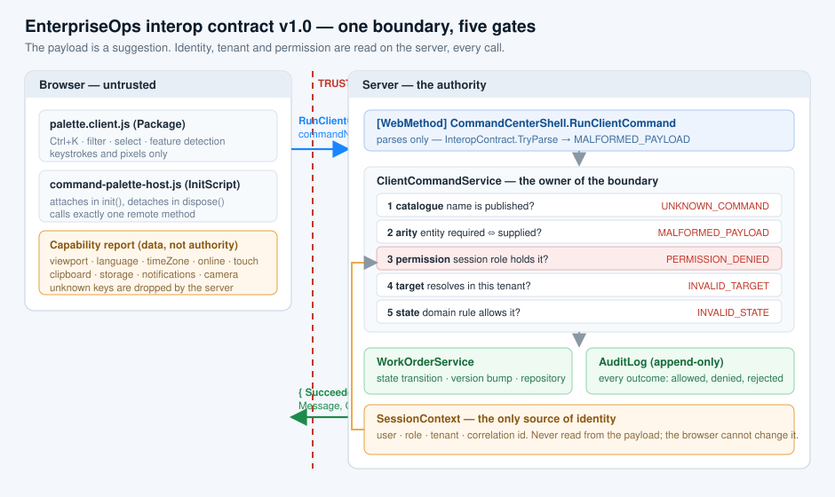

# Interop contract — EnterpriseOps client commands

**Version 1.0 · owner `EnterpriseOps.Services.ClientCommandService` · boundary `App.MainPage.RunClientCommand`**

One boundary, one contract. This document and
[`Interop/JavaScriptInteropContractPatterns.cs`](../Interop/JavaScriptInteropContractPatterns.cs) are meant to be
reviewed together: the file is this table in code, and neither may change without the other.



---

## 1. Name

| | |
| --- | --- |
| **Name** | `RunClientCommand` |
| **Purpose** | Let the browser *suggest* a named application command, so the server can decide whether to run it. |
| **Transport** | `Wisej.Core.WebMethod` on the top-level page `CommandCenterShell`, reachable as `App.MainPage.RunClientCommandAsync(...)`. |
| **Owner** | `EnterpriseOps.Services.ClientCommandService` — the only class that decides. The WebMethod parses and delegates; it contains no business rule. |
| **Version** | `1.0`, echoed in every result as `ContractVersion` so a mismatch shows up in a support ticket instead of in a bug report. |

## 2. Input schema

Three named fields. Nothing else crosses; an arbitrary JavaScript object would be unvalidatable by
definition, because the server would not know what it was looking at.

| Field | Type | Required | Rule | On violation |
| --- | --- | --- | --- | --- |
| `commandName` | string | yes | `^[a-z][a-z0-9]{1,15}(\.[a-z][a-z0-9]{1,15}){1,2}$`, ≤ 40 chars, and present in the published catalogue | `MALFORMED_PAYLOAD` (shape) / `UNKNOWN_COMMAND` (not in catalogue) |
| `entityId` | string | only for entity commands | `^WO-[0-9]{4}$`, ≤ 12 chars. Empty string when the command takes no entity — **never `null`** (a null argument is rejected by the Wisej client wrapper before the call leaves the browser) | `MALFORMED_PAYLOAD` |
| `correlationId` | string | yes | exactly 8 lower-case hexadecimal characters | `MALFORMED_PAYLOAD` |

Defaults: there are none. A missing field is a violation, not a default — that is what makes the
validator four lines long instead of a policy discussion.

**Not in the schema, and never accepted from the browser:** user name, role, tenant id, work-order
status, permission, capability flags. All four come from `SessionContext` on the server, every call.

## 3. Output schema

```jsonc
{ "Succeeded": false, "Code": "PERMISSION_DENIED", "CommandName": "workorder.approve",
  "Message": "You can't approve work order.", "CorrelationId": "6b91d4e2", "ContractVersion": "1.0" }
```

Field names are **not** camel-cased on the way back (a Wisej WebMethod return value keeps its .NET
casing, unlike `Options`), so the client tolerates both shapes. `Message` is written for a user; it
never quotes the payload, names an internal id or carries an exception message.

### Named failures

| Code | Meaning | Raised by |
| --- | --- | --- |
| `OK` | The command ran. | `ClientCommandService` |
| `MALFORMED_PAYLOAD` | A field broke its rule, or a command was called with/without an entity against its arity. | `InteropContract.TryParse`, gate 2 |
| `UNKNOWN_COMMAND` | The name is well-formed but not in the catalogue. | gate 1 |
| `PERMISSION_DENIED` | The **session** role does not hold the command's permission. | gate 3, via `PermissionService` |
| `INVALID_TARGET` | The id does not resolve **inside the session tenant** — deliberately the same answer as "does not exist", so the browser cannot enumerate other tenants. | gate 4 |
| `INVALID_STATE` | Permitted, resolvable, still refused by the domain rule. | gate 5, via `WorkOrderService` |
| `SERVER_ERROR` | Anything unexpected. The browser gets the code; the log gets the exception. | `RunClientCommand` catch |

## 4. The command catalogue

A command that is not in this list does not exist. The catalogue is the reason `UNKNOWN_COMMAND`
costs the server a dictionary lookup instead of a database round trip.

| `commandName` | Title | Shortcut | Permission | Entity |
| --- | --- | --- | --- | --- |
| `workorder.approve` | Approve work order… | Ctrl+Shift+A | `WorkOrder.Approve` | required |
| `workorder.reassign` | Reassign selected… | Ctrl+Shift+R | `WorkOrder.Reassign` | required |
| `workorder.escalate` | Escalate selected… | Ctrl+Shift+E | `WorkOrder.Escalate` | required |
| `workqueue.open` | Open work queue | Ctrl+1 | `WorkQueue.Open` | none |
| `import.new` | New import… | Ctrl+I | `Import.Create` | none |
| `diagnostics.open` | Open diagnostics | Ctrl+D | `Diagnostics.View` | none |

Role → permission (server-side, `Security/PermissionService.cs`):

| Role | Holds |
| --- | --- |
| Technician | `WorkQueue.Open`, `WorkOrder.Escalate` |
| Manager | the Technician set + `WorkOrder.Approve`, `WorkOrder.Reassign`, `Import.Create` |
| Admin | the Manager set + `Diagnostics.View` |

## 5. Validation order (and why it is that order)

```
1 catalogue   name is in the published list             → UNKNOWN_COMMAND
2 arity       entity required ⇔ entity supplied         → MALFORMED_PAYLOAD
3 permission  session role holds the permission         → PERMISSION_DENIED
4 target      id resolves inside the session tenant     → INVALID_TARGET
5 state       the domain rule allows the transition     → INVALID_STATE
```

Shape validation (`InteropContract.TryParse`) runs before gate 1, in the WebMethod itself: an
oversized or malformed payload must cost a regex, not a service call.

Permission is checked **before** the target is resolved. Otherwise a user who may not approve could
tell the difference between `INVALID_TARGET` and `INVALID_STATE` and use the boundary as a probe for
which work orders exist in a tenant they cannot see.

## 6. There is no second endpoint

`RunClientCommand` is the only execution endpoint. A method that accepted a role or a new status
from the browser would have **no contract** at all — it would believe whatever the payload claims.
That is the anti-pattern the walkthrough warns about, and this project does not contain one.

## 7. Versioning

Adding an optional field or a catalogue entry is a minor bump and does not break an older script.
Removing a field, tightening a rule, renaming a code or changing an outcome is a major bump: the
client sends nothing but the three fields, so an old client keeps working until the server refuses
its version explicitly. `ContractVersion` travels in every result to make that visible.

---

## Evidence — what the running app shows

The session is `ben.tech` (Technician) in tenant `contoso`; the palette targets `WO-1040`. "Server
log" is the `System.Diagnostics.Trace` output of `ActivityTrace`. The three codes the palette cannot
produce are reproduced by hand-editing the payload in the browser's dev tools — which is the point.

| Path | How to reproduce | What proves it |
| --- | --- | --- |
| Happy path | Ctrl+K → *escalate* → Enter | server log `Interop: ExecuteFromClient…` → `Security: … ALLOWED` → `Service: WorkOrderService.Escalate → Escalated` → `Audit: ALLOWED` |
| `PERMISSION_DENIED` | Ctrl+K → *approve* → Enter (the walkthrough's path) | banner *You can't approve work order.* · `PERMISSION_DENIED · … the command never ran`; server log `Security: PermissionService ben.tech (Technician, role from session) → WorkOrder.Approve → DENIED`; `Audit: DENIED` |
| `INVALID_STATE` | run *escalate* a second time | server log `Service: WorkOrderService.Escalate rejected: already Escalated` |
| `UNKNOWN_COMMAND` | dev tools: `App.MainPage.RunClientCommandAsync("workorder.delete", "WO-1040", "0000abcd")` | server log `catalogue lookup 'workorder.delete' → not found · no service called` |
| `MALFORMED_PAYLOAD` | dev tools: `App.MainPage.RunClientCommandAsync("workorder.approve", "WO-1040-INJECT", "not-a-corr")` | server log `payload rejected by the contract before any service ran · entityId is longer than 12 characters` — no `Security:` line at all |
| `INVALID_TARGET` | dev tools: `App.MainPage.RunClientCommandAsync("workorder.escalate", "WO-1060", "0000abcd")` | the id is well-formed and the user is permitted; server log `Data: … Find(tenant=contoso, id=1060) → not found` |
| Contract version | any command | every result carries `ContractVersion: "1.0"` |
