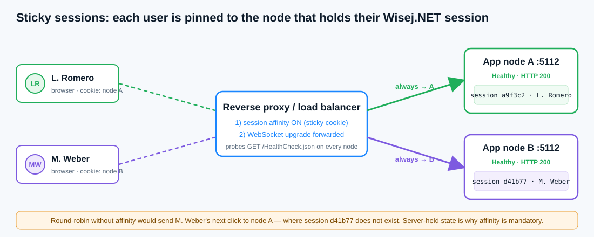

# Load-balancing notes — why Wisej.NET needs sticky sessions

*Module 12 deliverable*



## 1. The fact everything hangs off

A Wisej.NET session is **stateful and lives on the server**. The `ReleaseConsole` form, its `DiagnosticsPage`,
the `ActivityLog`, the `InMemoryTicketRepository` — every object `AppComposition` creates for a browser tab is a
real .NET object in the memory of **one** process. A click travels to the server, Wisej.NET finds *that* instance,
runs the handler, and sends back only what changed. That is why nothing here is serialized between clicks.

Two consequences:

1. **Load balancing needs affinity.** With two nodes and plain round-robin, a user's second request lands on a node
   that has never seen their session: the objects are not there, the UI resets, the WebSocket updates stop. Users are
   logged out mid-action and the bug reproduces only under load — the worst kind.
2. **A restart is a session eviction.** Recycling the pool, redeploying or scaling a node down destroys every
   in-memory session on it. The diagnostics page's **Sessions** row (`Application.SessionCount`) is exactly the
   number of people that restart interrupts — read it before you recycle.

**Plain-English definition.** A *sticky session* (session affinity) is a load-balancer rule that always sends a
given user back to the same node. Because the Wisej.NET session lives in that node's memory, affinity is
mandatory for every multi-instance deployment — not an optimization.

## 2. The rule the proxy must carry (two halves, both required)

```nginx
# Reverse proxy in front of two Kestrel nodes (NGINX shape; names vary by product)
upstream ticketops {
    sticky cookie ticketops_node expires=8h;   # 1) affinity: pin each browser to one node
    server app-node-a:5112;
    server app-node-b:5112;
}

server {
    location / {
        proxy_pass http://ticketops;
        proxy_http_version 1.1;
        proxy_set_header Upgrade $http_upgrade;   # 2) forward the WebSocket upgrade …
        proxy_set_header Connection "upgrade";    #    … or Wisej.NET falls back to long-polling
        proxy_read_timeout 3600s;                 #    keep the persistent connection alive
    }
    location = /HealthCheck.json {                # the probe target — cheap, unauthenticated, no secrets
        proxy_pass http://ticketops;
    }
}
```

Forget half 1 and users bounce between nodes and lose their session. Forget half 2 and the persistent connection
cannot establish through the proxy: the diagnostics page shows **WebSocket: long-polling fallback** and the
`websocket` health check reports **Degraded**. Both halves must be right.

| Product | Affinity setting | WebSocket setting |
|---|---|---|
| NGINX | `sticky cookie` (Plus) or `ip_hash` | `Upgrade`/`Connection` headers as above |
| Apache | `mod_proxy_balancer` + `stickysession=…` | `mod_proxy_wstunnel` |
| IIS ARR | *Client affinity* on the server farm | WebSocket protocol feature enabled |
| Azure App Service | *ARR affinity* **On** (default) | Web sockets **On** |
| AWS ALB | target group *stickiness* (LB cookie) | supported by default |

The alternative to affinity is a **shared session backing store** (externalized session state so any node can serve
any request). It survives a node dying mid-session and scales more smoothly, but it is more work; affinity is the
default recommendation for Wisej.NET.

## 3. How a load-balancer probe hits this app

`Startup.cs` serves static content through `UseFileServer` but **refuses every `.json`**, so `Default.json`
(startup type, theme, debug flag) never leaves the server. Module 12 adds one exception — the exact path
`/HealthCheck.json` — because the manifest carries nothing secret: app name, version, build, environment and the
*names* of the dependencies the node needs.

```
GET http://<node>:5112/HealthCheck.json   → 200 + the manifest      (process up, this build serving)
GET http://<node>:5112/Default.json       → refused by the file server (still protected)
```

What the probe learns from the static file is **liveness plus version**: the process answers and the `version`
matches the release. What it cannot learn from a static file is **readiness** — whether *this node* can reach its
store right now. That is what `IHealthCheckService.CheckAsync()` adds inside the app: it reads the same manifest
(`File.ReadAllText(Application.MapPath("HealthCheck.json"))`), probes `database` (`ITicketRepository.GetAllAsync`),
`storage` (a temp-file write) and `websocket` (`Application.IsWebSocket`), and aggregates with the rule in
`HealthReport.Aggregate`: any **Unhealthy** → `503` (take the node out), any **Degraded** → `200` but reported,
else **Healthy**.

A production `/health` endpoint would return exactly the JSON the diagnostics page shows, with the matching HTTP
status. To add it, map a lightweight endpoint in `Startup.cs` (`app.MapGet("/health", …)`) that runs a health-check
service composed **once per application** (not per session — the endpoint has no Wisej.NET session) against the
production repository; the domain rule and the JSON shape already exist and need no change. The probe URL then
moves from `/HealthCheck.json` to `/health`, and the static manifest remains the version proof.

## 4. What the health check must and must not do

- **Do** check the dependencies whose failure means this node cannot work (database reachable, disk writable).
- **Do** keep it cheap: a health check that runs a heavy query becomes the outage it was meant to detect.
- **Don't** put connection strings, internal host names or secrets in the body. `DependencyCheck.Detail` says
  *"ticket store unreachable"*; the driver's *"timeout connecting to sql01:1433"* stays in the log.
- **Don't** return 200 unconditionally — the balancer would keep sending traffic to a dead node.

## Evidence (what the running app shows)

- **WebSocket row** on the diagnostics page: `connected (server push on)` through a proxy that forwards the upgrade;
  `long-polling fallback` (and `websocket → Degraded`) when it does not.
- **Sessions row**: open <http://localhost:5112> in a second tab, press **↻ Refresh** in the first — the count climbs
  (`2 live on this node`). Each tab has its own `AppComposition` graph; the trace of one never shows the other's
  clicks. That per-node count is what affinity protects and what a restart evicts.
- **Degrade 'storage'** → `Degraded · HTTP 200 · still serving (6 open tickets loaded)`: a degraded dependency is
  reported, the node stays in rotation, the app keeps working.
- **Simulate repository outage** → `Unhealthy · HTTP 503 · out of rotation`: the balancer would stop sending new
  sessions here; **Recover the repository** → `Healthy · HTTP 200` — back in rotation.
