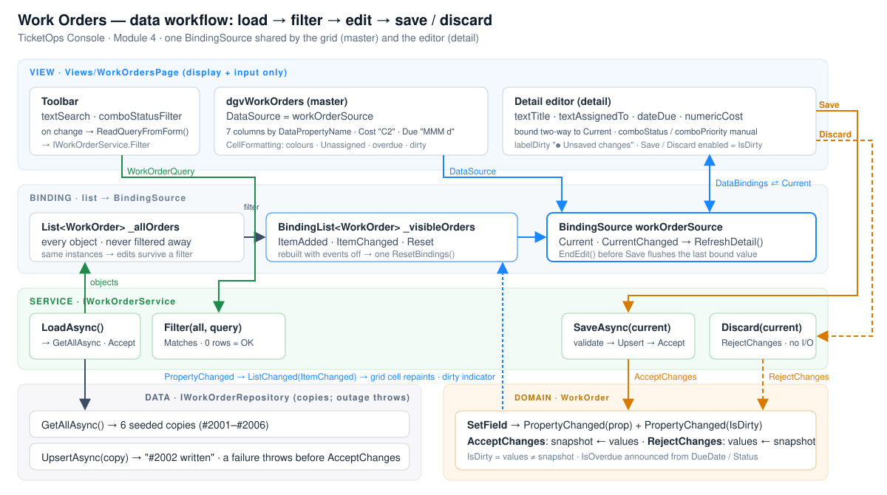

# Data workflow — load → filter → edit → save / discard

*Module 4 deliverable · TicketOps Console · Work Orders screen*

The diagram (`DataWorkflow.svg`) shows the five layers and the direction every value travels. Read it
top-down for user actions and bottom-up for notifications.

## 1. Load

| Step | Layer | What happens |
|---|---|---|
| Screen shown | View | `WorkOrdersPage_Load` → `LoadAsync()` |
| Query the store | Service → Data | `WorkOrderService.LoadAsync` → `IWorkOrderRepository.GetAllAsync()` (copies of the 6 seeded rows) |
| Clean rows | Service → Domain | `AcceptChanges()` on each object: a freshly loaded row is not a change |
| Fill the master list | View | `_allOrders` receives the objects; then `ApplyFilter` runs with the current query (empty at start) |
| Fill the grid | Binding | `RebindVisible` rebuilds the `BindingList` and calls `ResetBindings()` once; the grid reads the list through `workOrderSource`; the BindingSource makes row 0 current → `CurrentChanged` → the detail shows #2001 |

Nothing on the screen called `Rows.Add`. The grid's columns were declared in the Designer with
`DataPropertyName`; `Cost` and `DueDate` are formatted by the column style; `CellFormatting` adds the
enum text and colours.

## 2. Filter (search box + status dropdown)

| Step | Layer | What happens |
|---|---|---|
| The user types `pump` or picks **Open** | View | `textSearch_TextChanged` / `comboStatusFilter_SelectedIndexChanged` → `ApplyFilter` → `ReadQueryFromForm()` builds a `WorkOrderQuery` (UI → data) |
| Decide which rows match | Service → Domain | `IWorkOrderService.Filter(_allOrders, query)` applies `WorkOrderQuery.Matches` (title or assignee contains the text; status equals) to the **live objects the screen already holds** — it does not go back to the repository, so unsaved edits survive a filter |
| Show the subset | Binding | `RebindVisible`: events off → `Clear` → `Add` each match → events on → one `ResetBindings()`. `labelCount` shows "1 of 6 work orders"; the BindingSource picks a new current item; the detail follows |
| No match | View | Not a failure: grey banner *No work orders match the search…*, status **● no matches**, empty grid, editor disabled (`panelDetail.Enabled = false`, header *Select a work order to edit it here.*) |
| Clear the search | View | Same path with an empty query: every row comes back from the master list, no reload |

Why not `BindingSource.Filter = "Status = 'Open'"`? That string is forwarded to the underlying list, and
only list types that implement `IBindingListView` (a `DataView`) honour it. A `BindingList<T>` of objects
ignores it silently — which is exactly the kind of "the value doesn't appear" bug this module is about.

## 3. Edit (master-detail through one BindingSource)

| Step | What happens |
|---|---|
| Click row 2002 | The grid moves `workOrderSource.Current`. The four bound fields re-read `Title`, `AssignedTo`, `DueDate`, `Cost` from the new current item by themselves. `CurrentChanged` fills the header ("Work Order 2002") and the two enum combos, and refreshes the dirty state. No copying code |
| Type in **Title** | `textTitle` pushes the value into `WorkOrder.Title` (`DataSourceUpdateMode.OnPropertyChanged`) → `SetField` raises `PropertyChanged("Title")` and `PropertyChanged("IsDirty")` → `BindingList` raises `ListChanged(ItemChanged, row 1)` → the grid repaints the Title cell (amber, because `IsDirty`) → `UpdateDirtyState` shows **● Unsaved changes** and enables Save / Discard |
| Change **Cost** to 2150 | Same chain; the Cost cell shows `$2,150.00` because the column formats it |
| Pick **Status → In Progress** | Manual conversion: `comboStatus_SelectedIndexChanged` writes `current.Status = (WorkOrderStatus)SelectedIndex`; from there the chain is identical (the Status cell text and colour change, `IsOverdue` is re-announced) |
| Select another row with edits pending | Nothing is lost: the edits live on the *object*, which stays in the master list. The header shows **● 1 unsaved elsewhere**; come back to the row and it is still dirty. **↻ Reload** is refused while any row is dirty (*Save or discard the unsaved changes before reloading.*) |

## 4. Save (commit) and Discard (rollback)

| Step | Layer | What happens |
|---|---|---|
| **Save** | View | `workOrderSource.EndEdit()` flushes a value a bound control may still be holding, then `await _workOrders.SaveAsync(current)` |
| validate | Service | title required (≤ 80 chars), cost between $0 and $250,000, an in-progress order needs an assignee. A failure is a **result**: `OperationResult.Fail("Title is required.")`, the edits stay on screen, `IsDirty` stays true → orange banner |
| persist | Data | `UpsertAsync(order)` stores a **copy** |
| accept | Domain | `order.AcceptChanges()` — only now does the edited object become the saved state. `PropertyChanged("IsDirty")` clears the indicator and the amber title through the same binding chain → **● Work order #2002 saved.** |
| **Discard** | View → Service → Domain | `_workOrders.Discard(current)` → `order.RejectChanges()`: every setter is written back from the snapshot, each raises `PropertyChanged`, the fields and the grid row revert. Nothing is persisted → **● Changes to work order #2002 discarded.** |
| **Save fails** (the store throws) | Data → View | The exception arrives *before* `AcceptChanges` ran. The handler's `catch` logs it and shows `Strings.SaveFailedEditsKept`: *Your changes could not be saved and are still on screen.* The row is still dirty, the edits are still visible; Save again once the store answers |
