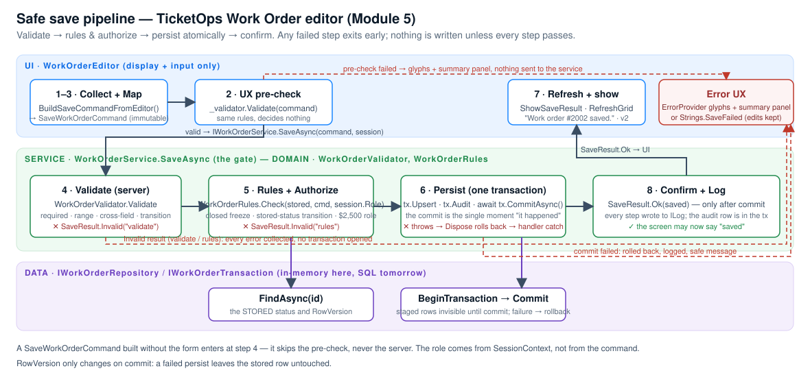

# The safe save pipeline

*Module 5 deliverable · TicketOps Console · `Services/WorkOrderService.SaveAsync`*

A save is not a database call. It is a fixed sequence that either completes or changes nothing — and the
order of the steps is what keeps the screen and the data from disagreeing. The video calls it "eight steps,
every save"; here is where each step lives in this project.

| # | Step (video) | Where | What happens | Exit if it fails |
|---|---|---|---|---|
| 1 | Collect | `WorkOrderEditor.BuildSaveCommandFromEditor` | read the controls once | — |
| 2 | Validate (UX) | `WorkOrderEditor.buttonSave_Click` → `WorkOrderValidator.Validate` | the same pure rules the server runs; instant feedback | glyphs + summary panel, `return` — nothing sent |
| 3 | Map | `BuildSaveCommandFromEditor` returns a `SaveWorkOrderCommand` | immutable; no control reference leaks past this line | — |
| 4 | Validate (server) | `WorkOrderService.SaveAsync` step 1 | re-runs `WorkOrderValidator` — the gate a crafted request cannot skip | `SaveResult.Invalid("validate", errors)` |
| 5 | Business rules + Authorize | step 2: `IWorkOrderRepository.FindAsync` then `WorkOrderRules.Check(stored, command, session.Role)` | closed-order freeze, transition table against the **stored** status, cost approval threshold against the **session's** role | `SaveResult.Invalid("rules", errors)` |
| 6 | Persist | step 3: `BeginTransaction()` → `Upsert` → `Audit` → `CommitAsync()` | the row and its audit entry are staged, then committed once | exception; `Dispose` rolls back; the handler shows `Strings.SaveFailed` |
| 7 | Refresh | `WorkOrderEditor` after `result.Succeeded` | grid reloads, editor shows the saved row (`v2`) | — |
| 8 | Log | every step writes to `ILog`; the audit entry is part of the transaction | the trace shows the whole journey | — |

## The four habits baked in

1. **Errors are collected, not thrown.** `ValidationResult` holds every field error and every summary error; the
   user fixes them all in one round-trip (TC-10 proves three at once).
2. **Nothing is written until everything passes.** Steps 4 and 5 return before `BeginTransaction()` is ever called —
   the trace for a rejected save has no `[DATA] tx#…` line at all.
3. **Persistence is atomic.** `IWorkOrderTransaction` stages the `UPDATE` and the `INSERT AuditLog` and applies them
   in one `CommitAsync`. When the commit throws (the write outage), `Dispose` logs `tx#n rolled back — 0 rows changed`
   and readers never saw the staged row. `RowVersion` only increments on commit, which is how
   `VerifyNothingPartial` can prove `#2002 … v1 — unchanged` afterwards.
4. **Success is reported after the commit, never before.** `SaveResult.Ok` is built from the object `CommitAsync`
   returned; the status bar cannot say "saved" for a save that did not happen.

## Results versus exceptions

| Outcome | Kind | Who handles it | What the user sees |
|---|---|---|---|
| a field is wrong, a rule says no | **result** — `SaveResult.Invalid` | `ShowSaveResult` → `ShowValidation` | glyph beside the field, summary panel, status **● 2 problems found — nothing was saved** |
| the store refused the commit | **exception** — `DataOutageException` | the handler's `catch` → `ReportFailure` | red banner + toast with `Strings.SaveFailed`; the edits stay in the editor |

The service logs the outage with its real message (`timeout connecting to sql01:1433 …`) at the `[DATA]` and `[SVC]`
layers and rethrows; the handler adds one `[UI]` line with the exception type and shows a sentence that contains none of it.

## Client versus server

| Concern | Editor (UX only) | Service (authoritative) |
|---|---|---|
| Required fields, ranges, formats | pre-check paints glyphs immediately | re-checked before persist |
| Status transition | pre-check flags illegal moves the editor knows about | re-checked against the **stored** status (TC-15) |
| Role restriction | nothing — the editor does not even know the role | `WorkOrderRules` with `SessionContext.Role` — the only enforcement point |
| Store unreachable | cannot know | commit throws, transaction rolls back, exception surfaces |

**Bypass: crafted command** builds a `SaveWorkOrderCommand` without the form and hands it to the service the way an
import job or a replayed request would. The validator passes it (cost 9,500 is in range) and the rules reject it for
a Technician. Switch **Acting as** to Supervisor and the same command saves: the role, read on the server, is the gate —
not a disabled button.

## What Module 6 adds

The lesson's pipeline has a *confirm* step for irreversible moves (Cancelled, Closed) — a modal "Are you sure?" between
validation and persistence. That belongs to Module 6 (`ApprovalDialog`, dialog results); here "confirm" is the
pipeline's final step: the service confirms to the screen that the commit happened.

## Evidence

- **Save** on a valid #2002 (change the title): trace `[UI] pre-check passed → …`, `[SVC] step 1 validate …`, `[DATA] FindAsync #2002 found — Assigned · v1`,
  `[SVC] step 2 rules …`, `[DOMAIN] WorkOrderRules.Check — all rules pass`, `[SVC] step 3 persist → BeginTransaction`, `[DATA] tx#1 open`,
  `[DATA] tx#1 stage UPDATE WorkOrders #2002`, `[DATA] tx#1 stage INSERT AuditLog …`, `[DATA] tx#1 committed — 1 row(s), 1 audit entry · #2002 now v2`,
  `[SVC] step 4 confirm …`, `[UI] OK · Work order #2002 saved.`; the grid's **Ver** column shows `v2`.
- **Simulate write outage**: the same lines through `stage INSERT AuditLog`, then `✖ [DATA] outage: COMMIT tx#2 … failed — timeout connecting to sql01:1433 …`,
  `⚠ [DATA] tx#2 rolled back — 0 rows changed (1 staged write(s) discarded)`, `✖ [SVC] persist failed after validation passed …`,
  `✖ [UI] caught DataOutageException — user sees the safe message, edits stay on screen`, `[UI] re-read #2002: v2 … — unchanged, nothing partial`.
