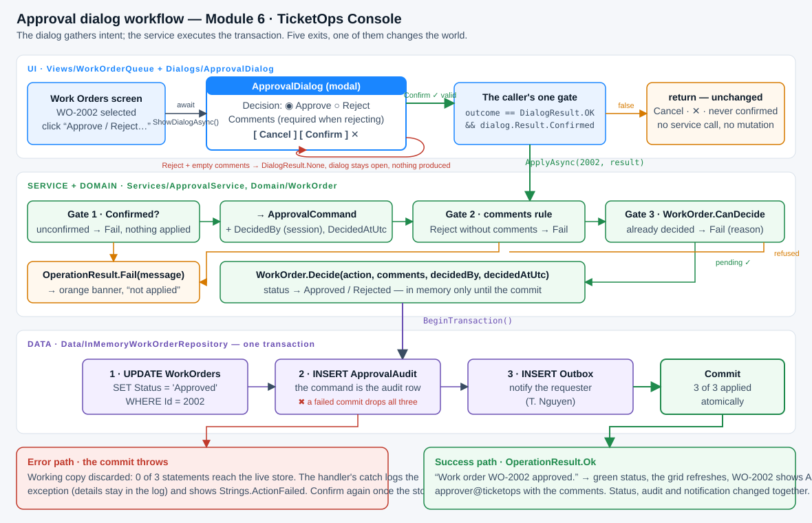

# Workflow diagram — the Approve / Reject checkpoint

*Module 6 deliverable · TicketOps Console*

The diagram (`ApprovalWorkflow.svg`) reads top to bottom through the three layers:

| Layer | What happens | Code |
|---|---|---|
| **UI** | The Work Orders screen opens `ApprovalDialog` for the selected order and awaits it. The dialog owns one decision (Approve / Reject), the comments, and its own validation. It has three exits: **Confirm**, **Cancel**, **✕**. | `Views/WorkOrderQueue.buttonReview_Click`, `Dialogs/ApprovalDialog` |
| **UI gate** | The caller makes exactly one check — `outcome == DialogResult.OK && dialog.Result.Confirmed`. Anything else returns: no service call, no mutation. | `WorkOrderQueue.buttonReview_Click` |
| **Service + Domain** | `ApprovalService.ApplyAsync(id, result)` re-checks the result (confirmed? comments on a rejection?), translates it into an `ApprovalCommand` with the trusted identity, asks the domain rule `WorkOrder.CanDecide`, then `WorkOrder.Decide`. Every refusal is an `OperationResult.Fail(message)` the screen may show. | `Services/ApprovalService`, `Domain/WorkOrder`, `Domain/ApprovalCommand` |
| **Data** | One transaction: `UPDATE WorkOrders`, `INSERT ApprovalAudit`, `INSERT Outbox`, then commit. Statements run on a working copy of the store that replaces the live store only when all three succeeded. | `Data/InMemoryWorkOrderRepository.Commit` |

## The five exits the video asks you to test

| Exit | Where it is decided | Result object | Service called? | Store |
|---|---|---|---|---|
| **Cancel** | dialog, `buttonCancel_Click` | `{confirmed:false}` | no | unchanged |
| **✕** (close box) | nobody — the default `Result` survives | `{confirmed:false}` | no | unchanged |
| **Validation failure** (Reject, empty comments) | dialog, `buttonConfirm_Click` → `DialogResult.None`, stays open | not built yet | no | unchanged |
| **Service failure** (the store refuses the commit) | repository, inside `CommitAsync` | confirmed | yes → throws | rolled back, 0 of 3 writes (RH-6) |
| **Success** | service, after the three gates | confirmed | yes → `Ok` | 3 of 3 writes, atomically |

Two more refusals are decided on the server side of the boundary even though the dialog would never
produce them: a "confirmed" rejection without comments (Gate 2) and a decision on an already-decided
order (Gate 3, `WorkOrder.CanDecide`). They exist because UI state is a convenience, never the authority:
a bulk job, an API endpoint or a bug in a second screen must hit the same rules.

## Evidence

- Open the app, select **WO-2002**, click **✓ Approve / Reject…**, keep Approve and **Confirm**: status
  **● Work order WO-2002 approved.**; the grid shows it Approved.
- Press **Cancel** or the **✕** instead: the status strip reads *Approval canceled — work order 2002 unchanged.*
- Choose **Reject**, leave the comments empty, press **Confirm**: the dialog stays open with *Comments are required when rejecting.*
- The service-failure exit is covered by RH-6 in `ResultHandlingTests.cs`.
